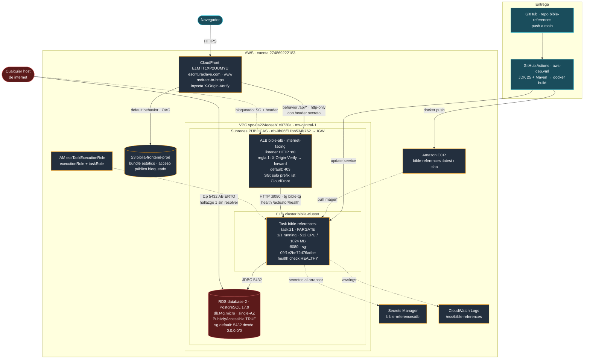
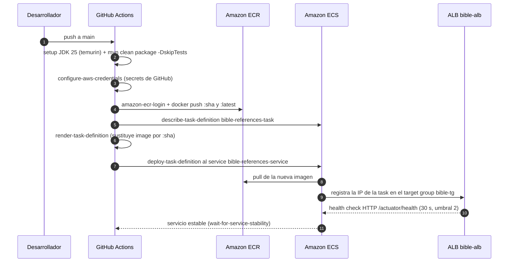

# Arquitectura AWS — bible-references

Cuenta: `274869222183` · Región: `mx-central-1` (México) · VPC: `vpc-0a224eceeb1c0720a`

Topología **verificada contra la infraestructura real** el 2026-07-31 mediante comandos
`describe-*` de la AWS CLI (identidad `arn:aws:iam::274869222183:user/gdgr`). Los nombres
de recursos, IDs, reglas de red y rutas provienen de la API de AWS, no de inferencias
sobre el repositorio.

**Este documento describe el estado posterior a los cambios aplicados el 2026-07-31.**
Ver el registro de cambios más abajo.

> **Revalidado y ampliado el 2026-08-04.** Se repitieron las consultas `describe-*`, se
> ejecutó `terraform plan` y se hizo un barrido completo de objetos sin uso. El camino de
> producción **no ha cambiado** desde el 2026-07-31 —misma revisión `:21`, misma task
> corriendo desde las 22:05 de ese día, `healthStatus: HEALTHY`—, pero sí se aplicaron
> cuatro cambios de higiene: ver el registro de abajo. El módulo de `terraform/` se
> actualizó en consecuencia y sigue siendo un espejo fiel:
> `28 to import, 0 to add, 3 to change, 0 to destroy`.

## Registro de cambios aplicados (2026-07-31)

| Hora | Cambio | Recurso | Hallazgo |
|---|---|---|---|
| 20:06 | Ingress del ALB restringido a la prefix list de CloudFront; revocadas las reglas `80` y `443` desde `0.0.0.0/0` | `sg-0f48e25801a170bef` | 2, fase 1 |
| 21:08 | Registrada revisión 18 con `startPeriod: 180` y `timeout: 15` — **intento fallido**, no corrigió nada | `bible-references-task:18` | 0 |
| 21:29 | Registrada y desplegada revisión 19 **sin health check de contenedor** | `bible-references-task:19` | 0 |
| 21:40 | Header `X-Origin-Verify` inyectado en el origen `Backend-API` | CloudFront `E1MTT1XP2UUMYU` | 2, fase 2 |
| 21:44 | Regla de listener con prioridad 1 exigiendo el header; acción por defecto a `403` | Listener `:80` de `bible-alb` | 2, fase 2 |
| 21:55 | Despliegue de CI con la imagen que instala `curl` (`Dockerfile` versionado) | `bible-references-task:20` | 0 |
| 22:05 | Health check de contenedor restaurado (`startPeriod: 180`, `timeout: 15`) | `bible-references-task:21` | 0 |

Runbooks con el detalle y los procedimientos de reversión:

- `runbook-hallazgo-0-bucle-reinicio.md`
- `runbook-hallazgo-2-alb-bypass.md`

## Registro de cambios aplicados (2026-08-04)

Higiene, a raíz del barrido de objetos sin uso. Ninguno toca el camino de producción;
verificado después: target `healthy` y servicio 1/1.

| Hora | Cambio | Recurso | Reversible |
|---|---|---|---|
| 14:21 | Retención de logs a 14 días (antes: nunca expiraban) | `/ecs/bible-references` y `/ecs/biblia-frontend-task` | Sí, `put-retention-policy` |
| ~15:0x | Lifecycle policy que conserva las **2 imágenes más recientes**; expira 16 (~2,3 GB) | ECR `bible-references` | La política sí; las imágenes borradas **no** |
| ~15:2x | Eliminado target group huérfano | `biblia-frontend-tg` | No |
| ~15:2x | Eliminado log group huérfano | `/ecs/biblia-frontend-task` | No |
| ~15:4x | Eliminados 4 stacks de CloudFormation de SAM, con sus 2 Lambdas, 3 API Gateways y 3 roles | `sam-app`, `my-new-app`, `pets-service`, `aws-sam-cli-managed-default` (us-east-1) | No |
| ~15:4x | Eliminados 2 security groups huérfanos | `biblia-sg`, `biblia-alb-sg` | No |
| ~15:4x | Eliminadas 4 políticas IAM sin adjuntos | `testgdavpolicy`, `ListAllBuckets-test1`, 2× `AWSLambdaBasicExecutionRole-*` | No |

Sobre la lifecycle policy de ECR: se validó antes con `start-lifecycle-policy-preview`
—que no borra nada— confirmando que la imagen en producción (`0c566343…`, revisión `:21`)
y la anterior quedan entre las conservadas. ECR evalúa las políticas de forma asíncrona,
así que el borrado puede tardar hasta 24 h en reflejarse.

Conservar solo 2 imágenes deja **un único paso de rollback**: tras dos despliegues
seguidos, la versión de hace dos ya no existe en ECR y habría que reconstruirla desde el
commit. Fue una decisión explícita.

La retención de logs se aplicó desde la consola, fuera de Terraform, y el módulo declaraba
`retention_in_days = 0`. Se detectó porque `terraform plan` empezó a marcar un cuarto
cambio; se rastreó en CloudTrail y se actualizó `storage_and_secrets.tf`. Es una
ilustración exacta del hallazgo 8: **un cambio manual no lo detecta nadie hasta que alguien
vuelve a correr `plan`.**

## Diagrama general



## Camino real del tráfico

CloudFront **sí fronteda la API**. La distribución `E1MTT1XP2UUMYU` tiene dos orígenes:

| Behavior | Origen | Destino | Protocolo al origen |
|---|---|---|---|
| default | `biblia-frontend-prod.s3...` | S3 (bundle estático) | OAC, sin acceso público |
| `/api/*` | `Backend-API` | `bible-alb-1227546912...elb.amazonaws.com` | `http-only` + header `X-Origin-Verify` |

Consecuencias:

- El navegador habla **siempre HTTPS con CloudFront**, y el edge termina TLS. Por eso el
  ALB no necesita listener 443 y solo tiene HTTP:80.
- El frontend y la API comparten origen (`escrituraclave.com`), así que **el CORS no
  interviene en el camino de producción**. La configuración de `app.frontend.origin` y el
  `OriginValidationFilter` siguen siendo útiles para desarrollo local y como defensa en
  profundidad, pero no son lo que habilita el tráfico real.
- Desde el 2026-07-31, el ALB solo acepta conexiones desde los rangos de CloudFront **y**
  solo atiende peticiones que traigan el header secreto. Todo lo demás recibe 403.

## Flujo de despliegue (CI/CD)



> **El `task-definition.json` del repositorio no se despliega.** El workflow lo sobrescribe
> con `aws ecs describe-task-definition` antes de renderizar, así que editarlo no tiene
> efecto: los cambios de CPU, memoria o health check hay que registrarlos como revisión
> nueva en AWS. Invertir esa relación —que el repo sea la fuente de verdad— está pendiente
> como mejora de pipeline.

## Componentes verificados

| Componente | Identificador | Detalle confirmado |
|---|---|---|
| CDN | CloudFront `E1MTT1XP2UUMYU` | Alias `escrituraclave.com` y `www`; `redirect-to-https`; inyecta `X-Origin-Verify` en el origen `Backend-API` |
| Frontend estático | S3 `biblia-frontend-prod` | Los 4 flags de Block Public Access en `true`; policy no pública |
| Registro de imágenes | ECR `bible-references` | Tags `:latest` y `:<git-sha>`; lifecycle policy que conserva las 2 más recientes (desde 2026-08-04) |
| Cluster | `biblia-cluster` | ECS |
| Servicio | `bible-references-service` | `ACTIVE`, desired 1 / running 1, FARGATE |
| Task definition | `bible-references-task:21` | 512 CPU / 1024 MB, `awsvpc`, health check `curl -f .../actuator/health` con `startPeriod: 180` |
| Red de la task | subredes `...1526d` (1a) y `...87fcd` (1b) | `assignPublicIp: ENABLED`, SG `sg-09f1e2be72d76adbe` |
| Load balancer | `bible-alb` | Internet-facing; un solo listener: HTTP:80 |
| Reglas del listener | prioridad 1 / default | 1: header `X-Origin-Verify` → `forward` a `bible-tg`; default: `fixed-response` 403 |
| Target group | `bible-tg` | HTTP 8080, target type `ip`, health check `/actuator/health`, intervalo 30 s, umbral 2 |
| SG del ALB | `sg-0f48e25801a170bef` (`bible-alb-sg`) | Única regla de entrada: `tcp/80` desde `pl-0246509e78ddf0729` |
| SG de las tasks | `sg-09f1e2be72d76adbe` (`bible-ecs-sg`) | Ingress 8080 **solo desde `bible-alb-sg`** — correcto |
| Base de datos | RDS `database-2` | PostgreSQL 17.9, `db.t4g.micro`, single-AZ, cifrada, backup 1 día |
| SG de la base de datos | `sg-050bc646783252d10` (`default`) | Ingress **5432 desde `0.0.0.0/0`** — sin resolver |
| Subredes y rutas | `rtb-0b06ff11bb534e762` (main) | Única tabla de rutas: `0.0.0.0/0 → igw-01d6dea5b230b8bdb`; **todas las subredes son públicas** |
| Secretos | `bible-references/db` | URL apunta a `database-2...rds.amazonaws.com:5432/bible_db` |
| Logs | `/ecs/bible-references` | Driver `awslogs`, prefijo `ecs`; retención 14 días (desde 2026-08-04). Único log group de la cuenta |
| IAM | `ecsTaskExecutionRole` | Usado como execution role **y** como task role |

## Hallazgos

### 0. RESUELTO — Bucle de reinicio del servicio

ECS reemplazaba la task continuamente. Los tasks morían con `healthStatus: UNHEALTHY` y
`exitCode: 137`.

**Causa: `curl` no existe en la imagen del contenedor.** El health check de la task
definition era:

```
CMD-SHELL   curl -f http://localhost:8080/actuator/health || exit 1
```

`eclipse-temurin:25-jre-jammy` es una imagen JRE mínima que no trae `curl` ni `wget`.
Verificado ejecutando la imagen real de ECR:

```
$ docker run --rm --entrypoint sh <ecr>/bible-references:latest -c "command -v curl"
CURL NO EXISTE
```

El comando fallaba **siempre**, con independencia del estado de la aplicación. La app
arrancaba correctamente y sin errores, en ~64 s (`Started BibleReferencesApplication in
64.016 seconds`). El health check del **ALB** —que sí hace un GET HTTP real sobre el mismo
endpoint— reportaba el target `healthy`. Esa asimetría entre un chequeo externo que pasa y
uno interno que falla era la firma del problema.

Métricas que descartaron otras causas: memoria estable entre 26 % y 33 % (no es OOM), CPU
en ~1,5 % fuera de los picos de arranque, y sin excepciones en el log.

**Secuencia de corrección:**

| Rev | Cambio | Resultado |
|---|---|---|
| 18 | `startPeriod` 60 → 180, `timeout` 10 → 15 | **Fallido** — el comando nunca podía tener éxito |
| 19 | Health check de contenedor eliminado | Bucle detenido; task en `UNKNOWN` |
| 20 | Despliegue de CI con la imagen que instala `curl` | `curl 7.81.0` confirmado en producción |
| 21 | Health check restaurado (`startPeriod: 180`, `timeout: 15`) | **`healthStatus: HEALTHY`** |

El `Dockerfile` versionado instala `curl` en la etapa de runtime, así que las imágenes
futuras lo conservarán. El último fallo de health check en el historial del servicio es de
las 21:26:47, previo a la revisión 19; no ha habido ninguno después.

> **Intento fallido registrado para no repetirlo.** Se atribuyó primero el fallo a que el
> `startPeriod` de 60 s quedaba 4 s por debajo del arranque de 64 s, y se registró la
> revisión 18 con `startPeriod: 180` y `timeout: 15`. No sirvió: el comando nunca podía
> tener éxito. El razonamiento que descartó la hipótesis de `curl` —"si faltara, ningún
> task pasaría de ~150 s"— era erróneo, porque ECS no reemplaza el contenedor en cuanto lo
> marca `UNHEALTHY`, sino con una latencia observada de entre 8 y 20 minutos.

Herramientas disponibles en la imagen, comprobadas: `bash`, `perl`, `getent`, `timeout`,
`java`. Ausentes: `curl`, `wget`, `nc`, `python3`, `busybox`.

### 1. CRÍTICO — SIN RESOLVER — La base de datos está expuesta a internet

**Es el único hallazgo crítico y sigue abierto.** Tres condiciones verificadas se combinan:

- `database-2` tiene `PubliclyAccessible: true`.
- Vive en el subnet group `default-vpc-0a224eceeb1c0720a`, cuyas tres subredes usan la
  tabla de rutas principal con `0.0.0.0/0 → igw-01d6dea5b230b8bdb`, es decir, son públicas.
- Su grupo de seguridad es el `default` de la VPC, que permite **tcp/5432 desde
  `0.0.0.0/0`**.

El resultado es que `database-2.c1ggwasugrmo.mx-central-1.rds.amazonaws.com:5432` acepta
conexiones desde cualquier host de internet, y lo único que separa los datos de un atacante
es la contraseña. Queda expuesta a fuerza bruta, a escaneo masivo de puertos y a cualquier
CVE de autenticación de PostgreSQL.

Remediación, en orden:

1. Reemplazar la regla `5432 desde 0.0.0.0/0` por `5432 desde sg-09f1e2be72d76adbe`
   (`bible-ecs-sg`). Es el cambio que cierra la exposición y **debe ir primero**; sin él,
   los pasos siguientes no aportan nada.
2. Poner `PubliclyAccessible: false`.
3. Crear subredes privadas y un DB subnet group propio, y mover la instancia.
4. Dejar de usar el SG `default` para la base de datos; crear `bible-rds-sg` dedicado.
5. Rotar la contraseña, asumiendo que pudo haber sido expuesta.

> Los pasos 1 y 2 modifican la ruta de red de una base de datos en uso. El paso 2 provoca
> un cambio de la IP pública y puede requerir reinicio. Convendría aplicarlos en ventana
> de mantenimiento y confirmando primero que la task de ECS alcanza la instancia por su
> DNS interno.

### 2. RESUELTO — El ALB era alcanzable saltándose CloudFront

`bible-alb-sg` admitía 80 y 443 desde `0.0.0.0/0`, de modo que cualquiera podía pegarle
directamente al DNS del balanceador en HTTP plano, evitando el edge y todo lo que
CloudFront aporta.

**Aplicado en dos fases:**

*Fase 1 (red).* El SG del ALB quedó con una única regla de entrada: `tcp/80` desde la
managed prefix list `pl-0246509e78ddf0729`
(`com.amazonaws.global.cloudfront.origin-facing`). Se revocaron las reglas `80` y `443`
desde `0.0.0.0/0`; la de 443 no tenía listener detrás.

*Fase 2 (identidad del origen).* La fase 1 deja fuera a cualquier host que no sea
CloudFront, pero no distingue esta distribución de la de otra cuenta. CloudFront inyecta
ahora `X-Origin-Verify` con un valor secreto de 32 bytes, y el listener del ALB lo exige:

| Prioridad | Condición | Acción |
|---|---|---|
| 1 | header `X-Origin-Verify` con el valor secreto | `forward` a `bible-tg` |
| default | — | `fixed-response` 403 |

Verificado tras el cambio: el sitio y `/api/bible/chapter/1/1` responden 200, el acceso
directo al DNS del ALB agota el tiempo de espera, y el target sigue `healthy`.

El secreto vive únicamente en la configuración de CloudFront; no se guardó copia local.
Para recuperarlo:

```bash
aws cloudfront get-distribution-config --id E1MTT1XP2UUMYU \
  --query 'DistributionConfig.Origins.Items[?Id==`Backend-API`].CustomHeaders.Items' \
  --output json
```

> **Lo que esto no cubre:** el tramo CloudFront → ALB sigue siendo `http-only`, sin
> cifrar. Cerrarlo requiere un listener 443 en el ALB con certificado ACM y cambiar el
> origen a `https-only`. Queda pendiente.

### 3. MEDIO — Sin resiliencia en la capa de datos ni en la de cómputo

`database-2` es single-AZ, con `BackupRetentionPeriod: 1` día y
`DeletionProtection: false`. El servicio ECS corre con `desiredCount: 1`. Cualquier fallo
de zona, o un `delete-db-instance` accidental, implica caída e incluso pérdida de datos.
Como mínimo: activar deletion protection, subir la retención de backups y considerar
Multi-AZ. Subir el desired count a 2 exige antes resolver el punto 4.

### 4. MEDIO — Hazelcast usa descubrimiento por multicast

`hazelcast.yaml` declara `multicast: enabled: true`, y el multicast no funciona dentro de
una VPC de AWS, Fargate `awsvpc` incluido. Con la única task actual nada falla, pero al
escalar cada instancia tendrá su propia caché aislada y servirán datos divergentes. Para
clustering real hace falta el discovery de `hazelcast-aws` (por ECS o por tags), o mover
la caché a ElastiCache.

### 5. MEDIO — El task role y el execution role son el mismo

`taskRoleArn` y `executionRoleArn` apuntan ambos a `ecsTaskExecutionRole`, de modo que la
aplicación corre con permisos de pull de ECR y lectura de secretos que no necesita en
runtime. Conviene separarlos y dejar el task role con lo mínimo indispensable.

### 6. MEDIO — Llaves estáticas en GitHub Actions

El workflow se autentica con `AWS_ACCESS_KEY_ID` y `AWS_SECRET_ACCESS_KEY`, credenciales
de larga vida guardadas como secretos del repositorio. OIDC con un rol asumible las
elimina por completo.

### 6b. POR CONFIRMAR — Peticiones rechazadas por el filtro de origen

`OriginValidationFilter` no valida el header estándar `Origin`, sino uno propio,
`X-Client-Origin`, y devuelve 403 cuando falta. En los logs aparecen rechazos sobre rutas
que parecen tráfico legítimo de la aplicación:

```
Request blocked: missing Origin header, path=/api/bible/chapter/1/7
Request blocked: missing Origin header, path=/api/bible/chapter/1/1
Request blocked: missing Origin header, path=/api/bible/chapter/1/8
```

Si el frontend envía `X-Client-Origin`, estos rechazos serían escáneres o bots pegándole
al ALB, y el filtro está haciendo su trabajo. Si no lo envía, son usuarios reales
recibiendo 403. Conviene revisar el cliente antes de decidir si es un problema; el nombre
del header hace fácil confundirlo con el `Origin` que manda el navegador solo.

> Nota: tras la fase 2 del hallazgo 2, los bots ya no pueden alcanzar el ALB
> directamente, así que si estos rechazos eran escáneres deberían desaparecer del log. Es
> una forma sencilla de despejar la duda: si siguen apareciendo, vienen del frontend.

### 7. PARCIALMENTE RESUELTO — Recursos huérfanos

Un barrido completo de la cuenta el 2026-08-04 encontró varios recursos sin uso. Dos se
eliminaron ese mismo día; el resto sigue abierto.

**Eliminados el 2026-08-04**, tras confirmar que nada los referenciaba:

| Recurso | Evidencia previa al borrado |
|---|---|
| Target group `biblia-frontend-tg` | 0 targets, 0 balanceadores asociados; ninguna regla del listener lo referenciaba |
| Log group `/ecs/biblia-frontend-task` | La familia `biblia-frontend-task` tenía 0 revisiones activas; último evento en abril de 2026 |

Ambos eran restos de cuando se pensó servir el frontend desde el balanceador; hoy lo sirve
CloudFront desde S3. Tras el borrado se verificó que `bible-tg` sigue `healthy` y el
servicio en 1/1. `bible-tg` y `/ecs/bible-references` son ahora el único target group y el
único log group de la cuenta.

**Eliminados también el 2026-08-04, en una segunda pasada:**

| Recurso | Cómo |
|---|---|
| SGs `biblia-sg` (`sg-06179292d0aba63da`) y `biblia-alb-sg` (`sg-097d84a75b2c197ef`) | `delete-security-group`, tras confirmar 0 ENIs y 0 referencias desde reglas de otros SGs |
| Roles `ecsTaskExecRole`, `getUsersOpen-role-lobve5u3`, `getUsersSecure-role-s844o17t` | Ya no existían al ir a borrarlos |
| Stacks `sam-app`, `my-new-app`, `pets-service` (us-east-1) | `delete-stack` |
| Stack `aws-sam-cli-managed-default` (us-east-1) | `delete-stack`; su bucket ya no existía |
| Políticas `testgdavpolicy`, `ListAllBuckets-test1` y 2× `AWSLambdaBasicExecutionRole-*` | `delete-policy`, todas con 0 adjuntos |

**Se borraron por stack, no recurso a recurso.** Las 2 Lambdas de `us-east-1` pertenecían a
stacks de CloudFormation de SAM (2024), y con ellas venían recursos que el primer barrido
no había encontrado: **3 API Gateways** (`z50n53vqpk` y `mkm44gg4aj` REST, `gusjzecqk4`
HTTP) con sus stages `Prod`/`$default` desplegados, más los roles IAM y los permisos de
invocación. Borrar los Lambdas sueltos habría dejado los stacks en estado inconsistente y
los API Gateways vivos —endpoints públicos— sin que nadie los echara de menos.

Estado resultante, verificado: **1 rol** (`ecsTaskExecutionRole`), **1 política**
(`biblia-frontend-deploy-policy`), **3 security groups** (todos en uso), y en `us-east-1`
**0** stacks, **0** Lambdas y **0** API Gateways. Producción intacta: servicio 1/1, target
`healthy` y `https://escrituraclave.com/api/bible/chapter/1/1` respondiendo 200.

**Pendiente, requiere credenciales root:**

| Recurso | Bloqueo |
|---|---|
| Bucket `testbucketfordataassessments` (us-east-1, 4,7 KB) | Su propia bucket policy lo impide |

La policy (`AWSConsole-AccessLogs-Policy`, de octubre de 2017) es un `Deny` sobre
`Principal: "*"` que **incluye `s3:DeleteBucketPolicy`**, con excepción únicamente para
principals cuyo ARN contenga `797873946194` —una cuenta de AWS ajena, probablemente de
algún proveedor de auditoría— o para peticiones desde una lista fija de IPs de 2017. El
usuario `gdgr` no cumple ninguna de las dos, así que ni puede vaciar el bucket ni retirar
la policy.

Un `Deny` explícito en una bucket policy no se puede sortear con permisos de IAM. La única
salida es el salvaguarda de AWS contra el bloqueo permanente: **el usuario root de la
cuenta propietaria siempre conserva `s3:DeleteBucketPolicy`.** Entrando como root:

```bash
aws s3api delete-bucket-policy --bucket testbucketfordataassessments
aws s3 rm s3://testbucketfordataassessments --recursive
aws s3api delete-bucket --bucket testbucketfordataassessments --region us-east-1
```

Cuesta céntimos al mes, así que no corre prisa; lo que sí conviene revisar es **por qué una
cuenta ajena tuvo acceso concedido a un bucket de esta cuenta**.

> **Lo que el barrido confirmó que está limpio:** 0 volúmenes EBS sueltos, 0 Elastic IPs
> sin asociar, 0 ENIs disponibles, 0 instancias EC2, 0 snapshots manuales, 0 AMIs, 0 NAT
> gateways, 0 VPC endpoints, 0 hosted zones en Route53. El barrido por **todas** las
> regiones confirma que no hay nada facturable fuera de `mx-central-1`. La alarma de
> facturación funciona y tiene suscripción confirmada.

### 8. PARCIALMENTE RESUELTO — Infraestructura versionada pero no adoptada

Toda la infraestructura descrita aquí está ahora declarada en `terraform/`. El módulo
**describe el estado real, no una versión mejorada de él**: los hallazgos 1, 3, 4 y 5
quedan escritos tal como están, con comentarios que explican qué falla y cómo se corrige,
para que `plan` no proponga cambios. Verificado el 2026-08-04:

```
Plan: 27 to import, 0 to add, 3 to change, 0 to destroy.
```

Los 3 cambios son cosméticos y no corresponden a diferencias reales con AWS; están
explicados en `terraform/README.md`.

**Lo que falta: nunca se ha ejecutado `terraform apply`.** No existe archivo de state, así
que hoy el módulo es documentación ejecutable, no la fuente de verdad:

- AWS sigue siendo la única autoridad sobre lo que está desplegado.
- Un cambio hecho a mano en la consola no lo detecta nadie hasta que alguien vuelva a
  correr `plan`.
- Los 27 bloques `import` de `imports.tf` siguen siendo necesarios; solo se pueden borrar
  después del primer `apply`.

Además, `.github/workflows/aws-dep.yml` sobrescribe la task definition en cada push
(`aws ecs describe-task-definition > task-definition.json`), de modo que el pipeline y
Terraform compiten por ese recurso. El módulo lo evita hoy con `ignore_changes`, que es un
parche. Ver el apartado correspondiente de `terraform/README.md`.

Siguiente paso: adoptar el state (`apply` de los imports, que no toca nada en AWS) y
mover el state a un backend S3 cifrado —contiene el header secreto de CloudFront en
claro—. Hay un ejemplo comentado en `terraform/versions.tf`.

## Lo que sí está bien configurado

- El bucket S3 tiene los cuatro flags de Block Public Access activos y su policy no es
  pública: el bundle se sirve exclusivamente vía CloudFront.
- `bible-ecs-sg` restringe el puerto 8080 a `bible-alb-sg`, sin CIDR abierto. Es
  exactamente el patrón correcto, y contrasta con la regla del SG de la base de datos.
- El almacenamiento de RDS está cifrado.
- El health check del target group coincide con el endpoint que Actuator expone, y
  Actuator no publica más que `health` con `show-details: never`.
- Desde el 2026-07-31, el ALB solo es alcanzable desde CloudFront y solo con el header
  secreto.

## Cómo se verificó

Consultas de solo lectura usadas para levantar el inventario:

```bash
aws sts get-caller-identity
aws elbv2 describe-listeners --load-balancer-arn <bible-alb>
aws elbv2 describe-rules --listener-arn <listener>
aws elbv2 describe-target-groups --names bible-tg
aws elbv2 describe-target-health --target-group-arn <bible-tg>
aws ecs describe-services --cluster biblia-cluster --services bible-references-service
aws ecs describe-task-definition --task-definition bible-references-task
aws ecs describe-tasks --cluster biblia-cluster --tasks <task>
aws rds describe-db-instances
aws ec2 describe-security-groups     --filters Name=vpc-id,Values=vpc-0a224eceeb1c0720a
aws ec2 describe-security-group-rules --filters Name=group-id,Values=<sg>
aws ec2 describe-route-tables        --filters Name=vpc-id,Values=vpc-0a224eceeb1c0720a
aws ec2 describe-network-interfaces  --filters Name=group-id,Values=<sg>
aws ec2 describe-managed-prefix-lists --filters Name=prefix-list-name,Values=com.amazonaws.global.cloudfront.origin-facing
aws cloudfront list-distributions
aws cloudfront get-distribution-config --id E1MTT1XP2UUMYU
aws s3api get-public-access-block   --bucket biblia-frontend-prod
aws s3api get-bucket-policy-status  --bucket biblia-frontend-prod
aws logs get-log-events --log-group-name /ecs/bible-references --log-stream-name <stream>
aws cloudwatch get-metric-statistics --namespace AWS/ECS --metric-name MemoryUtilization ...
```

Comandos que **sí modificaron** infraestructura, todos documentados en los runbooks con su
reversión:

```bash
aws ec2 authorize-security-group-ingress   # regla con prefix list de CloudFront
aws ec2 revoke-security-group-ingress      # reglas 80 y 443 abiertas
aws ecs register-task-definition           # revisiones 18 y 19
aws ecs update-service                     # despliegue de la revisión 19
aws cloudfront update-distribution         # header X-Origin-Verify
aws elbv2 create-rule                      # regla de prioridad 1
aws elbv2 modify-listener                  # acción por defecto a 403
```

> Sobre el entorno de trabajo: la AWS CLI en Windows falla con
> `'charmap' codec can't encode character` al leer logs con emoji; se soluciona con
> `PYTHONUTF8=1`. Git Bash convierte rutas como `/ecs/bible-references` en rutas de
> Windows; se soluciona con `MSYS_NO_PATHCONV=1`. Y el `curl` de schannel puede fallar con
> `CRYPT_E_REVOCATION_OFFLINE`, que se sortea con `--ssl-no-revoke`.

## Trabajo pendiente, por prioridad

1. **Hallazgo 1** — cerrar el acceso a RDS desde internet. Único crítico abierto.
2. **Hallazgo 8** — adoptar el state de Terraform y moverlo a un backend cifrado. Barato
   (el `apply` de los imports no toca AWS) y desbloquea que los demás hallazgos se
   corrijan por código en vez de a mano.
3. **Hallazgo 3** — deletion protection y retención de backups en RDS.
4. **Cifrar el tramo CloudFront → ALB** (listener 443 con ACM, origen a `https-only`).
5. **Hallazgo 6b** — confirmar si el frontend envía `X-Client-Origin`.
6. **Hallazgos 4, 5, 6** — Hazelcast, separación de roles IAM, OIDC.
7. **Hallazgo 7** — solo queda el bucket `testbucketfordataassessments`, que exige
   credenciales root. Céntimos al mes; lo relevante es entender por qué una cuenta ajena
   tenía acceso concedido.
