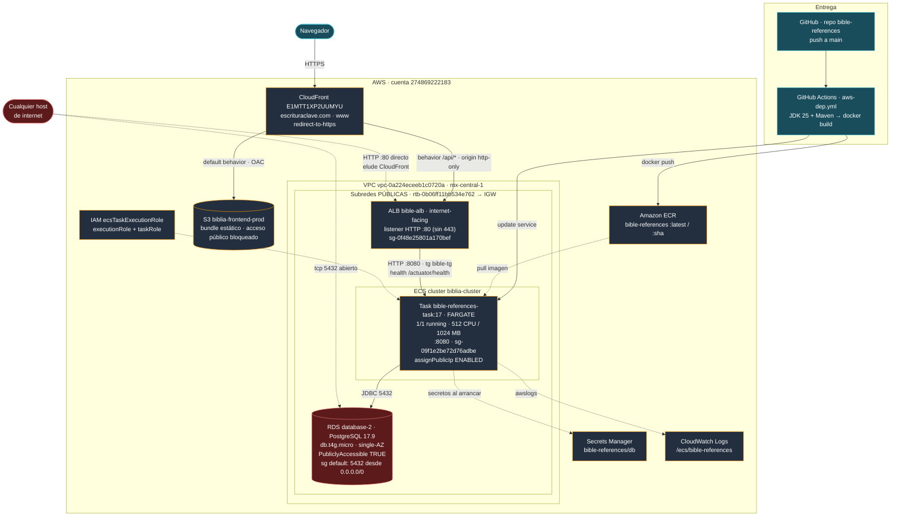
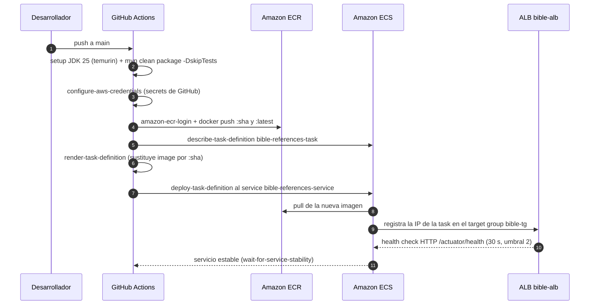

# Arquitectura AWS — bible-references

Cuenta: `274869222183` · Región: `mx-central-1` (México) · VPC: `vpc-0a224eceeb1c0720a`

Topología **verificada contra la infraestructura real** el 2026-07-31 mediante comandos
`describe-*` de la AWS CLI (identidad `arn:aws:iam::274869222183:user/gdgr`). Los nombres
de recursos, IDs, reglas de red y rutas de este documento provienen de la API de AWS, no
de inferencias sobre el repositorio.

## Diagrama general



## Camino real del tráfico

CloudFront **sí fronteda la API**. La distribución `E1MTT1XP2UUMYU` tiene dos orígenes:

| Behavior | Origen | Destino | Protocolo al origen |
|---|---|---|---|
| default | `biblia-frontend-prod.s3...` | S3 (bundle estático) | OAC, sin acceso público |
| `/api/*` | `Backend-API` | `bible-alb-1227546912.mx-central-1.elb.amazonaws.com` | `http-only` |

Consecuencias:

- El navegador habla **siempre HTTPS con CloudFront**, y el edge termina TLS. Por eso el
  ALB no necesita listener 443 y solo tiene HTTP:80.
- El frontend y la API comparten origen (`escrituraclave.com`), así que **el CORS no
  interviene en el camino de producción**. La configuración de `app.frontend.origin` y el
  `OriginValidationFilter` siguen siendo útiles para desarrollo local y como defensa en
  profundidad, pero no son lo que habilita el tráfico real.

## Flujo de despliegue (CI/CD)



## Componentes verificados

| Componente | Identificador | Detalle confirmado |
|---|---|---|
| CDN | CloudFront `E1MTT1XP2UUMYU` | Alias `escrituraclave.com` y `www`; `redirect-to-https`; estado `Deployed` |
| Frontend estático | S3 `biblia-frontend-prod` | Los 4 flags de Block Public Access en `true`; policy no pública |
| Registro de imágenes | ECR `bible-references` | Tags `:latest` y `:<git-sha>` |
| Cluster | `biblia-cluster` | ECS |
| Servicio | `bible-references-service` | `ACTIVE`, desired 1 / running 1, FARGATE |
| Task definition | `bible-references-task:17` | 512 CPU / 1024 MB, `awsvpc` |
| Red de la task | subredes `...1526d` (1a) y `...87fcd` (1b) | `assignPublicIp: ENABLED`, SG `sg-09f1e2be72d76adbe` |
| Load balancer | `bible-alb` | Internet-facing; **un solo listener: HTTP:80** |
| Target group | `bible-tg` | HTTP 8080, target type `ip`, health check `/actuator/health`, intervalo 30 s, umbral 2 |
| SG del ALB | `sg-0f48e25801a170bef` (`bible-alb-sg`) | Ingress 80 y 443 desde `0.0.0.0/0` |
| SG de las tasks | `sg-09f1e2be72d76adbe` (`bible-ecs-sg`) | Ingress 8080 **solo desde `bible-alb-sg`** — correcto |
| Base de datos | RDS `database-2` | PostgreSQL 17.9, `db.t4g.micro`, single-AZ, cifrada, backup 1 día |
| SG de la base de datos | `sg-050bc646783252d10` (`default`) | Ingress **5432 desde `0.0.0.0/0`** |
| Subredes y rutas | `rtb-0b06ff11bb534e762` (main) | Única tabla de rutas: `0.0.0.0/0 → igw-01d6dea5b230b8bdb`; **todas las subredes son públicas** |
| Secretos | `bible-references/db` | URL apunta a `database-2...rds.amazonaws.com:5432/bible_db` |
| Logs | `/ecs/bible-references` | Driver `awslogs`, prefijo `ecs` |
| IAM | `ecsTaskExecutionRole` | Usado como execution role **y** como task role |

## Hallazgos

### 0. ACTIVO — El servicio está en bucle de reinicio

ECS reemplaza la task de forma continua, al menos desde las 18:00 del 2026-07-31 (el grupo
de logs acumula ~58 streams). Los tasks mueren con `healthStatus: UNHEALTHY` y
`exitCode: 137`.

**Causa confirmada: `curl` no existe en la imagen del contenedor.**

El health check de la task definition es:

```
CMD-SHELL   curl -f http://localhost:8080/actuator/health || exit 1
```

Y la imagen desplegada no lo tiene. Verificado ejecutando la imagen real de ECR:

```
$ docker run --rm --entrypoint sh <ecr>/bible-references:latest -c "command -v curl"
CURL NO EXISTE
$ ls /usr/bin/curl
ls: cannot access '/usr/bin/curl': No such file or directory
```

`eclipse-temurin:25-jre-jammy` es una imagen JRE mínima: no trae `curl` ni `wget`. El
comando del health check falla **siempre**, con independencia del estado de la
aplicación, y ECS acaba reemplazando el contenedor.

**La aplicación no tiene la culpa.** Arranca correctamente y sin errores, en ~64 s:

```
Started BibleReferencesApplication in 64.016 seconds
```

Métricas que descartan otras causas: la memoria se mantiene estable entre 26 % y 33 % (no
es OOM), fuera de los picos de arranque la CPU ronda el 1,5 %, y no hay excepciones en el
log. El health check del **ALB** —que sí hace un GET HTTP real sobre el mismo endpoint—
reporta el target `healthy`. Esa asimetría entre un chequeo externo que pasa y uno interno
que falla es la firma del problema.

> **Intento fallido registrado para no repetirlo.** Se atribuyó primero el fallo a que el
> `startPeriod` de 60 s quedaba 4 s por debajo del arranque de 64 s, y se registró la
> revisión 18 con `startPeriod: 180` y `timeout: 15`. **No sirvió**: los tasks de la
> revisión 18 siguen `UNHEALTHY`, porque el comando nunca puede tener éxito. El
> razonamiento que descartó la hipótesis de `curl` —"si faltara, ningún task pasaría de
> ~150 s"— era erróneo: ECS no reemplaza el contenedor en cuanto lo marca `UNHEALTHY`,
> sino con una latencia observada de entre 8 y 20 minutos.

Remediación (ver `runbook-hallazgo-0-bucle-reinicio.md`):

- **Sin reconstruir la imagen:** sustituir el comando por uno que use `bash` con
  `/dev/tcp`, disponible en la imagen; o eliminar el health check de contenedor y confiar
  en el del ALB, que ya funciona y también provoca el reemplazo de tasks caídos.
- **Reconstruyendo:** instalar `curl` en el `Dockerfile` y conservar el chequeo actual.

Herramientas disponibles en la imagen, comprobadas: `bash`, `perl`, `getent`, `timeout`,
`java`. Ausentes: `curl`, `wget`, `nc`, `python3`, `busybox`.

### 1. CRÍTICO — La base de datos está expuesta a internet

Tres condiciones verificadas se combinan:

- `database-2` tiene `PubliclyAccessible: true`.
- Vive en el subnet group `default-vpc-0a224eceeb1c0720a`, cuyas tres subredes usan la
  tabla de rutas principal con `0.0.0.0/0 → igw-01d6dea5b230b8bdb`, es decir, son públicas.
- Su grupo de seguridad es el `default` de la VPC, que permite **tcp/5432 desde
  `0.0.0.0/0`**.

El resultado es que `database-2.c1ggwasugrmo.mx-central-1.rds.amazonaws.com:5432` acepta
conexiones desde cualquier host de internet, y lo único que separa los datos de un atacante
es la contraseña. Queda expuesta a fuerza bruta, a escaneo masivo de puertos y a cualquier
CVE de autenticación de PostgreSQL.

Remediación, en orden:

1. Reemplazar la regla `5432 desde 0.0.0.0/0` por `5432 desde sg-09f1e2be72d76adbe`
   (`bible-ecs-sg`). Es el cambio que cierra la exposición y **debe ir primero**; sin él,
   los pasos siguientes no aportan nada.
2. Poner `PubliclyAccessible: false`.
3. Crear subredes privadas y un DB subnet group propio, y mover la instancia.
4. Dejar de usar el SG `default` para la base de datos; crear `bible-rds-sg` dedicado.
5. Rotar la contraseña, asumiendo que pudo haber sido expuesta.

> Los pasos 1 y 2 modifican la ruta de red de una base de datos en uso. El paso 2 provoca
> un cambio de la IP pública y puede requerir reinicio. Convendría aplicarlos en ventana
> de mantenimiento y confirmando primero que la task de ECS alcanza la instancia por su
> DNS interno.

### 2. ALTO — El ALB es alcanzable saltándose CloudFront

`bible-alb-sg` admite 80 y 443 desde `0.0.0.0/0`, así que cualquiera puede pegarle
directamente a `bible-alb-1227546912.mx-central-1.elb.amazonaws.com` **en HTTP plano**,
evitando el edge. Todo lo que CloudFront aporte (WAF, rate limiting, caché, TLS) se
esquiva trivialmente, y el tráfico viaja sin cifrar.

Remediación: restringir el ingress del ALB a la managed prefix list
`com.amazonaws.global.cloudfront.origin-facing`, y añadir un header secreto en el origin de
CloudFront que el ALB exija mediante una regla del listener. Eliminar además la regla 443,
que hoy no tiene listener detrás.

### 3. MEDIO — Sin resiliencia en la capa de datos ni en la de cómputo

`database-2` es single-AZ, con `BackupRetentionPeriod: 1` día y
`DeletionProtection: false`. El servicio ECS corre con `desiredCount: 1`. Cualquier fallo
de zona, o un `delete-db-instance` accidental, implica caída e incluso pérdida de datos.
Como mínimo: activar deletion protection, subir la retención de backups y considerar
Multi-AZ. Subir el desired count a 2 exige antes resolver el punto 4.

### 4. MEDIO — Hazelcast usa descubrimiento por multicast

`hazelcast.yaml` declara `multicast: enabled: true`, y el multicast no funciona dentro de
una VPC de AWS, Fargate `awsvpc` incluido. Con la única task actual nada falla, pero al
escalar cada instancia tendrá su propia caché aislada y servirán datos divergentes. Para
clustering real hace falta el discovery de `hazelcast-aws` (por ECS o por tags), o mover
la caché a ElastiCache.

### 5. MEDIO — El task role y el execution role son el mismo

`taskRoleArn` y `executionRoleArn` apuntan ambos a `ecsTaskExecutionRole`, de modo que la
aplicación corre con permisos de pull de ECR y lectura de secretos que no necesita en
runtime. Conviene separarlos y dejar el task role con lo mínimo indispensable.

### 6. MEDIO — Llaves estáticas en GitHub Actions

El workflow se autentica con `AWS_ACCESS_KEY_ID` y `AWS_SECRET_ACCESS_KEY`, credenciales
de larga vida guardadas como secretos del repositorio. OIDC con un rol asumible las
elimina por completo.

### 6b. POR CONFIRMAR — Peticiones reales rechazadas por el filtro de origen

`OriginValidationFilter` no valida el header estándar `Origin`, sino uno propio,
`X-Client-Origin`, y devuelve 403 cuando falta. En los logs aparecen rechazos sobre rutas
que parecen tráfico legítimo de la aplicación:

```
Request blocked: missing Origin header, path=/api/bible/chapter/1/7
Request blocked: missing Origin header, path=/api/bible/chapter/1/1
Request blocked: missing Origin header, path=/api/bible/chapter/1/8
```

Si el frontend envía `X-Client-Origin`, estos rechazos serían escáneres o bots pegándole
al ALB, y el filtro está haciendo su trabajo. Si no lo envía, son usuarios reales
recibiendo 403. Conviene revisar el cliente antes de decidir si es un problema; el nombre
del header hace fácil confundirlo con el `Origin` que manda el navegador solo.

### 7. BAJO — Grupos de seguridad huérfanos

`biblia-sg` (`sg-06179292d0aba63da`) y `biblia-alb-sg` (`sg-097d84a75b2c197ef`) tienen
**cero interfaces de red asociadas**; ambos abren 80/443 al mundo. Se pueden eliminar sin
impacto.

### 8. INFORMATIVO — Infraestructura no versionada

Nada de lo anterior —distribución de CloudFront, bucket S3, listener, target group,
instancia RDS, subredes, grupos de seguridad— vive en el repositorio. Todo se creó a mano
y solo se puede auditar consultando la API. Llevarlo a Terraform o CDK haría que los
hallazgos 1, 2 y 3 fueran visibles en una revisión de código en vez de requerir una
auditoría manual.

## Lo que sí está bien configurado

- El bucket S3 tiene los cuatro flags de Block Public Access activos y su policy no es
  pública: el bundle se sirve exclusivamente vía CloudFront.
- `bible-ecs-sg` restringe el puerto 8080 a `bible-alb-sg`, sin CIDR abierto. Es
  exactamente el patrón correcto, y contrasta con la regla del SG de la base de datos.
- El almacenamiento de RDS está cifrado.
- El health check del target group coincide con el endpoint que Actuator expone, y
  Actuator no publica más que `health` con `show-details: never`.

## Cómo se verificó

```bash
aws sts get-caller-identity
aws elbv2 describe-listeners --load-balancer-arn <bible-alb>
aws elbv2 describe-target-groups --names bible-tg
aws ecs describe-services --cluster biblia-cluster --services bible-references-service
aws rds describe-db-instances
aws ec2 describe-security-groups --filters Name=vpc-id,Values=vpc-0a224eceeb1c0720a
aws ec2 describe-route-tables --filters Name=vpc-id,Values=vpc-0a224eceeb1c0720a
aws ec2 describe-network-interfaces --filters Name=group-id,Values=<sg>
aws cloudfront list-distributions
aws s3api get-public-access-block --bucket biblia-frontend-prod
aws s3api get-bucket-policy-status --bucket biblia-frontend-prod
```

Todos son de solo lectura; ninguno modificó infraestructura.
